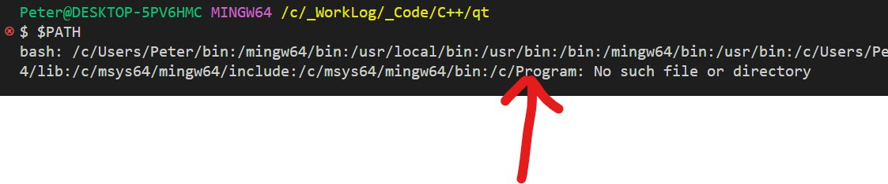
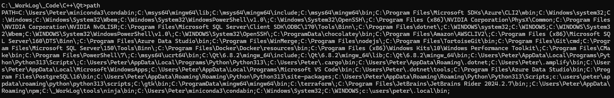

# Qt Notes

```text
"-lC:/Qt/6.8.2/mingw_64/lib/libQt6Widgets.a",
"-lC:/Qt/6.8.2/mingw_64/lib/libQt6Gui.a",
"-lC:/Qt/6.8.2/mingw_64/lib/libQt6Core.a"

win32-g++

"DUNICODE",
"D_UNICODE",
"DWIN32",
"DMINGW_HAS_SECURE_API=1",
"DQT_WIDGETS_LIB",
"DQT_GUI_LIB",
"DQT_CORE_LIB"

                "-v",
                "-Wl,--verbose",
                "-Wall",
                "-Wextra",
                "-pendantic",
                "-subsystem",
                "windows -mthreads"

```

## Build Instructions

- Assume `make` is installed
- Run command `qmake {projec-name}.pro`
- Note, for some reason I can't run this successfully from my `Git Bash` shell
- But it works fine from a `Windows Command Prompt`
- Run `make` (defaults to `release` target) or `make debug` as desired
- Run `./release/hello.exe`

### `Thursday, 7/24/25`

- `C:\gtk\bin` must be added to `PATH` in order for `pkg-config` to be found
- `pkg-config gtk4 --libs` for example
- Packages are found under `PKG_CONFIG_PATH` environment variable
- Laboriously confirmed I am using `gcc` and `g++` under: `C:\msys64\ucrt64\bin`
- Unfortunately, `Qt` and `qmake` require `/c/ProgramData/mingw64/mingw64/bin/g++` to be set
- No other combination works, that I can see.
- As long as that's in the path, my `Qt` app builds with `qmake` & `make`
- `C:\msys64\ucrt64\bin` is required for my `gtk` sample
- If `C:\msys64\ucrt64\bin` is below the other one, my `gtk` sample breaks

### `Wednesday, 7/23/25`

- Troubleshooting inability to build via `VS Code` and `Git Bash` shell on Windows
- Suspect the issue is with how the `PATH` variable resolves, see:'



and


